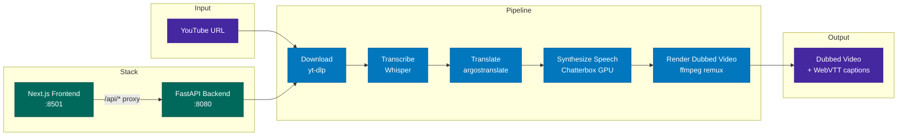

# Foreign Whispers

[](./LICENSE)

YouTube video dubbing pipeline — transcribe, translate, and dub 60 Minutes interviews into a target language.

The pipeline downloads a YouTube video, transcribes the speech with Whisper,
runs pyannote speaker diarization, translates each segment offline with
argostranslate, synthesizes time-aligned Spanish speech with Chatterbox TTS
(per-speaker voice cloning), and remuxes the result with rolling WebVTT
captions.

## Demo

End-to-end run on *Strait of Hormuz disruption threatens to shake global
economy* (CBS 60 Minutes), English → Spanish, three speakers each cloned to a
distinct voice using diarization-extracted reference clips:

**Watch:** https://www.youtube.com/watch?v=a1EMOFqWtY0

Pipeline configuration: `Aligned + chatterbox + pyannote`, Whisper STT
(`faster-whisper-medium`), argostranslate `en → es`, Chatterbox multilingual
TTS with per-speaker voice cloning.

## Architecture



## Quick Start

### Prerequisites

- NVIDIA GPU with CUDA 12.4-compatible driver (Ada / Ampere / Hopper). The
  pinned PyTorch wheels are `torch==2.5.1+cu124`.
- Docker + Docker Compose, with the NVIDIA Container Toolkit installed
  (`nvidia-container-toolkit` package — required for GPU passthrough into
  containers).
- A HuggingFace account with **license acceptance** on both
  [`pyannote/speaker-diarization-3.1`](https://huggingface.co/pyannote/speaker-diarization-3.1)
  and [`pyannote/segmentation-3.0`](https://huggingface.co/pyannote/segmentation-3.0).
  Diarization fails without both.
- A HuggingFace access token with **read access to gated repos**. Either a
  classic *Read* token (works automatically), or a fine-grained token with
  *Read access to contents of all public gated repos you can access* enabled.
  Put it in `.env` as `FW_HF_TOKEN=hf_…`.

### Running

Two profiles are available via Docker Compose:

```bash
# NVIDIA GPU — Whisper + Chatterbox on dedicated GPU containers
docker compose --profile nvidia up -d

# CPU only — no GPU containers (STT/TTS must be provided externally)
docker compose --profile cpu up -d
```

Open **http://localhost:8501** in your browser.

### `.env` template

```bash
# HuggingFace token with gated-repo read access (required for diarization)
FW_HF_TOKEN=hf_xxx

# Optional Logfire observability
FW_LOGFIRE_WRITE_TOKEN=

# Optional Chatterbox tuning (defaults shown)
FW_TTS_TEMPERATURE=0.4         # lower = more consistent voice across calls
FW_TTS_CFG=0.5
FW_TTS_EXAGG=0.4
FW_TTS_READ_TIMEOUT=300        # per-segment seconds; bump for very long Spanish
FW_TTS_WORKERS=3               # concurrent TTS calls per video

# Optional download tuning
FW_GEO_BYPASS_COUNTRY=US        # X-Forwarded-For spoof for region-locked videos
```

## Pipeline Stages

| Stage | What it does | Output |
|-------|-------------|--------|
| **Download** | Fetch video + captions from YouTube via yt-dlp | `videos/`, `youtube_captions/` |
| **Transcribe** | Speech-to-text via Whisper | `transcriptions/whisper/` |
| **Translate** | Source → target language via argostranslate (offline, OpenNMT) | `translations/argos/` |
| **Synthesize Speech** | TTS via Chatterbox (GPU) or Coqui (CPU fallback), time-aligned to original segments | `tts_audio/chatterbox/` |
| **Render Dubbed Video** | Replace audio track via ffmpeg remux (no re-encoding) | `dubbed_videos/` |

Captions are served as WebVTT via the `<track>` element — no subtitle burn-in:

| Endpoint | Source | Output |
|----------|--------|--------|
| `GET /api/captions/{id}/original` | YouTube captions (generated on the fly) | — |
| `GET /api/captions/{id}` | Translated segments + YouTube timing offset | `dubbed_captions/*.vtt` |

## Project Structure

```
foreign-whispers/
├── api/src/                     # FastAPI backend (layered architecture)
│   ├── main.py                  # App factory + lazy model loading
│   ├── core/config.py           # Pydantic settings (FW_ env prefix)
│   ├── routers/                 # Thin route handlers
│   │   ├── download.py          # POST /api/download
│   │   ├── transcribe.py        # POST /api/transcribe/{id}
│   │   ├── translate.py         # POST /api/translate/{id}
│   │   ├── tts.py               # POST /api/tts/{id}
│   │   └── stitch.py            # POST /api/stitch/{id}, GET /api/video/*, /api/captions/*
│   ├── services/                # Business logic (HTTP-agnostic)
│   ├── schemas/                 # Pydantic request/response models
│   └── inference/               # ML model backend abstraction
├── frontend/                    # Next.js + shadcn/ui
│   ├── src/components/          # Pipeline tracker, video player, result panels
│   ├── src/hooks/use-pipeline.ts # State machine for pipeline orchestration
│   └── src/lib/api.ts           # API client
├── download_video.py            # yt-dlp wrapper
├── transcribe.py                # Whisper wrapper
├── translate_en_to_es.py        # argostranslate wrapper
├── tts_es.py                    # Chatterbox client + time-aligned TTS generation
├── translated_output.py         # ffmpeg audio remux + legacy subtitle compositing
├── pipeline_data/               # All intermediate and output files (volume-mounted)
│   └── api/
│       ├── videos/              # Downloaded source MP4s
│       ├── youtube_captions/    # Line-delimited JSON from yt-dlp
│       ├── transcriptions/
│       │   └── whisper/         # Whisper output JSON
│       ├── translations/
│       │   └── argos/           # argostranslate output JSON
│       ├── tts_audio/
│       │   └── chatterbox/       # TTS WAV files per config
│       ├── dubbed_captions/     # Target-language VTT
│       ├── dubbed_videos/       # Final dubbed MP4s per config
│       └── speakers/            # Reference voice clips
├── docker-compose.yml           # Profiles: nvidia, cpu, apple
├── Dockerfile                   # Multi-stage: cpu and gpu targets
└── docs/
    └── dubbing-alignment-design.md  # TTS temporal alignment literature survey + design
```

## API Endpoints

| Method | Endpoint | Description |
|--------|----------|-------------|
| POST | `/api/download` | Download YouTube video + captions |
| POST | `/api/transcribe/{id}` | Whisper speech-to-text |
| POST | `/api/translate/{id}` | Source → target language translation |
| POST | `/api/tts/{id}` | Time-aligned TTS synthesis |
| POST | `/api/stitch/{id}` | Audio remux (ffmpeg -c:v copy) |
| GET | `/api/video/{id}` | Stream dubbed video (range requests) |
| GET | `/api/video/{id}/original` | Stream original video (range requests) |
| GET | `/api/captions/{id}` | Translated WebVTT captions |
| GET | `/api/captions/{id}/original` | Original English WebVTT captions |
| GET | `/api/audio/{id}` | TTS audio (WAV) |
| GET | `/healthz` | Health check |

## Development

### Container architecture

```
Host machine
├── foreign_whispers/      ← bind-mounted into API container
├── api/                   ← bind-mounted into API container
├── pipeline_data/api/     ← bind-mounted into API container
│
└── Docker Compose
    ├── foreign-whispers-stt   (GPU)  :8000  — Whisper inference
    ├── foreign-whispers-tts   (GPU)  :8020  — Chatterbox inference
    ├── foreign-whispers-api   (CPU)  :8080  — FastAPI orchestrator
    └── foreign-whispers-frontend      :8501  — Next.js UI
```

The API container is CPU-only — it delegates all GPU work to the STT and TTS
containers via HTTP. The `foreign_whispers/` library and `api/` source are
**bind-mounted** from the host, so edits on the host are immediately visible
inside the container.

### Editing and debugging the library

1. **Start all services:**

   ```bash
   docker compose --profile nvidia up -d
   ```

2. **Edit any file** in `foreign_whispers/` or `api/` on the host (e.g. in VS Code).

3. **Restart the API container** to pick up changes:

   ```bash
   docker compose --profile nvidia restart api
   ```

   To avoid manual restarts, add `--reload` to the uvicorn command in
   `docker-compose.yml`:

   ```yaml
   command: ["uv", "run", "uvicorn", "api.src.main:app", "--host", "0.0.0.0", "--port", "8080", "--reload"]
   ```

   With `--reload`, uvicorn watches for file changes and restarts automatically.

4. **Test via the SDK** from a notebook or Python REPL on the host:

   ```python
   from foreign_whispers import FWClient
   fw = FWClient()             # connects to http://localhost:8080
   fw.transcribe("GYQ5yGV_-Oc")
   ```

5. **Test the library directly** (no Docker needed for pure-Python alignment work):

   ```python
   from foreign_whispers import global_align, compute_segment_metrics, clip_evaluation_report
   ```

   This is the two-phase workflow:
   - **Phase 1 (SDK):** Call `FWClient` methods to drive the pipeline through Docker (download, transcribe, translate, TTS, stitch). Data lands in `pipeline_data/api/`.
   - **Phase 2 (library):** Import `foreign_whispers` directly to iterate on alignment algorithms using data produced in Phase 1. No GPU or Docker needed.

### Local setup (no Docker)

```bash
uv sync                    # install all dependencies
uv run python -c "from foreign_whispers import FWClient; print('ok')"
```

For Jupyter/VS Code notebooks, register the kernel once:

```bash
uv pip install ipykernel
uv run python -m ipykernel install --user --name foreign-whispers
```

Then select the **foreign-whispers** kernel in VS Code's kernel picker.

### When to rebuild

| Change | Action needed |
|--------|--------------|
| Edit `foreign_whispers/*.py` or `api/**/*.py` | Restart API container (or use `--reload`) |
| Edit `pyproject.toml` / add dependencies | `docker compose --profile nvidia build api && docker compose --profile nvidia up -d api` |
| Edit `frontend/` | Frontend has its own hot-reload; no action needed |
| Edit `docker-compose.yml` | `docker compose --profile nvidia up -d` (re-creates changed services) |

### File ownership

The API container runs as your host UID/GID (set in `.env`), so all files it
creates in `pipeline_data/` are owned by you — not root. If you see permission
errors on existing files, they were created by an older root-mode container:

```bash
sudo chown -R $(id -u):$(id -g) pipeline_data/
```

### Frontend

```bash
cd frontend && pnpm install && pnpm dev
```

### Requirements

- Python 3.11
- ffmpeg (system-wide)
- deno (for yt-dlp YouTube extraction)
- NVIDIA GPU recommended for Whisper + Chatterbox inference

## Operating Notes

This section captures gotchas encountered while building and running the
pipeline end-to-end.

### Per-speaker voice cloning

Per-speaker voices require reference WAV clips in `pipeline_data/speakers/`
matching the diarization output. The recommended extraction format for
Chatterbox's multilingual model is:

| Param | Value |
|---|---|
| Sample rate | **24 000 Hz** |
| Channels | mono |
| Codec | `pcm_s16le` |
| Duration | **5–10 s** of clean single-speaker speech (skip leading silence) |

Layout the resolver expects (see `foreign_whispers/voice_resolution.py`):

```
pipeline_data/speakers/
├── default.wav                 # global fallback
└── es/
    ├── default.wav             # language default
    ├── SPEAKER_00.wav          # per-speaker clones, matching diarization labels
    ├── SPEAKER_01.wav
    └── SPEAKER_02.wav
```

Clips outside the expected duration / sample-rate window can fail Chatterbox's
internal mel/token-length sanity check and the model returns 500 with
`maximum recursion depth exceeded in comparison`. Stick to the parameters
above and refresh references whenever you switch source videos.

### HuggingFace gated models

`pyannote/speaker-diarization-3.1` is a *pipeline* repo whose underlying weights
live in `pyannote/segmentation-3.0`. Both must be license-accepted on the same
HuggingFace account that owns `FW_HF_TOKEN` — accepting only the diarization
repo silently fails at model download time with a generic "could not download"
error. The `whoami-v2` API endpoint is useful for inspecting token scope:

```bash
curl -s https://huggingface.co/api/whoami-v2 \
  -H "Authorization: Bearer $FW_HF_TOKEN" | jq '.auth.accessToken.fineGrained'
```

If `canReadGatedRepos: false`, edit the token to enable *Read access to
contents of all public gated repos you can access*, or replace with a classic
Read token.

### Cache layout and re-running individual stages

Each stage caches its output. Subsequent calls short-circuit when the artifact
exists:

| Stage | Cache path | Wipe to force re-run |
|---|---|---|
| Download | `videos/<title>.mp4`, `youtube_captions/<title>.txt` | `rm pipeline_data/api/videos/<title>.mp4` |
| Transcribe | `transcriptions/whisper/<title>.json` | `rm <that file>` |
| Diarize | `diarizations/<title>.json` | `rm pipeline_data/api/diarizations/<title>.json` |
| Translate | `translations/argos/<title>.json` | `rm <that file>` |
| TTS | `tts_audio/chatterbox/<config>/<title>.wav` | `rm -rf <config dir>` |
| Stitch | `dubbed_videos/<config>/<title>.mp4`, `dubbed_captions/<config>/<title>.vtt` | `rm -rf <those dirs>` |

When changing settings that affect upstream segments (e.g. enabling
diarization after a translation already ran), wipe everything from that stage
downstream so the new metadata flows through:

```bash
# Force diarization to re-run and downstream stages to pick up speaker labels
rm -rf pipeline_data/api/diarizations/*
rm -rf pipeline_data/api/translations/argos/*
rm -rf pipeline_data/api/tts_audio/chatterbox/*/
rm -rf pipeline_data/api/dubbed_videos/*/
rm -rf pipeline_data/api/dubbed_captions/*/
```

### Side-loading videos around YouTube geo-restrictions

Some 60 Minutes uploads are region-locked and refuse to download from VM IPs.
The download endpoint short-circuits when the local file already exists, so
you can manually drop an MP4 in place:

```bash
yt-dlp -f "bestvideo[ext=mp4]+bestaudio[ext=m4a]/best" \
       --merge-output-format mp4 \
       -o "<exact registry title>.%(ext)s" \
       "https://www.youtube.com/watch?v=<id>"

# Drop into pipeline_data/api/videos/ on the VM with uid 1000
scp ... && sudo chown 1000:1000 pipeline_data/api/videos/<title>.mp4
```

`FW_GEO_BYPASS_COUNTRY=US` enables yt-dlp's X-Forwarded-For spoof for lighter
restrictions but doesn't help when YouTube also GeoIPs the CDN.

### Container ownership

The api container runs as uid `1000` (`appuser`). Bind-mounted directories
created by Docker default to `root:root`, which the container can't write to.
Fix once when you set up a fresh VM:

```bash
sudo chown -R 1000:1000 pipeline_data cookies.txt
chmod -R u+rwX pipeline_data
chmod 644 cookies.txt
```

If `cookies.txt` shows up as a directory after a `docker compose down`, that's
Docker's bind-mount auto-mkdir trap — `rm -rf cookies.txt` then re-create it
as a regular file before bringing the stack back up.

### TTS stability notes

- Chatterbox's CUDA context becomes poisoned for the lifetime of the process
  if a single request triggers a `device-side assert`. Subsequent calls return
  500 until the container is fully restarted (`stop` + `rm` + `up`, not just
  `restart`). When debugging Aligned mode, restart Chatterbox between runs.
- `FW_TTS_TEMPERATURE` defaults to `0.4` (Chatterbox's own default is 0.8).
  Lower values produce more consistent timbre across consecutive calls on the
  same reference WAV at the cost of expressiveness.
- Long Spanish segments can take >60 s to synthesize; the per-call HTTP read
  timeout is set to 300 s by default and can be raised via
  `FW_TTS_READ_TIMEOUT`.

### Captions

`/api/captions/{video_id}` serves the dubbed-language WebVTT and
`/api/captions/{video_id}/original` serves the source-language one. To upload
a dub to YouTube with toggleable subtitles, upload the MP4 and add the VTT in
YouTube Studio's subtitles UI; or mux the VTT into the MP4 locally as a
soft-subtitle track:

```bash
ffmpeg -i dubbed.mp4 -i dubbed.vtt \
  -c copy -c:s mov_text \
  -metadata:s:s:0 language=spa \
  dubbed-with-subs.mp4
```
